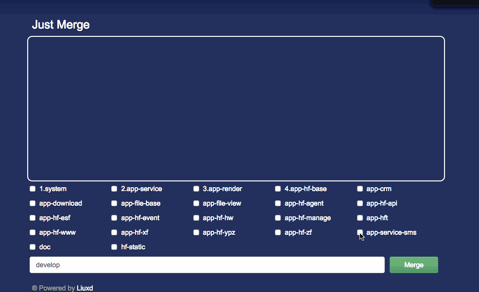

# Just Merge

### Feature

+ Merge multiple repositories in the same time.
+ Real-time output.

### Dependence

[Node.js](http://nodejs.org/)

### Installation

```
git clone git@github.com:liuxd/just-merge.git
cd just-merge
npm install
```

### Let's start!

```
cd just-merge
./boss.sh start
```

### Screen Shot

